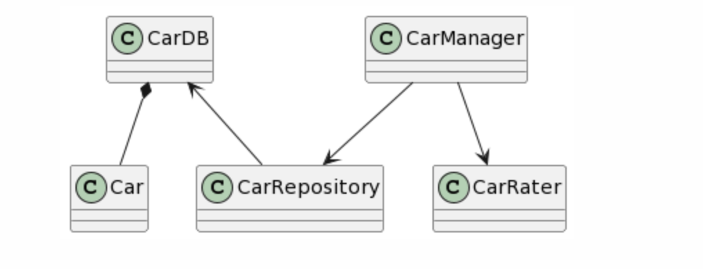
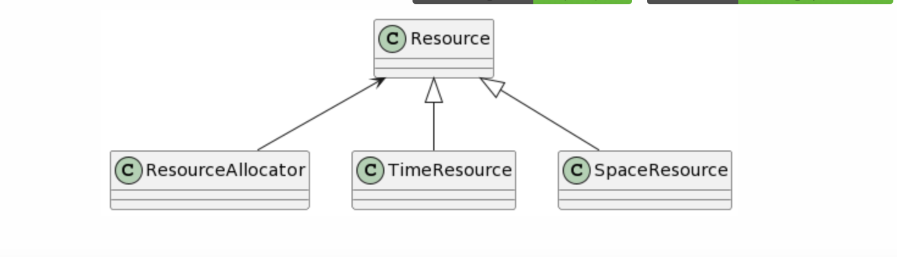
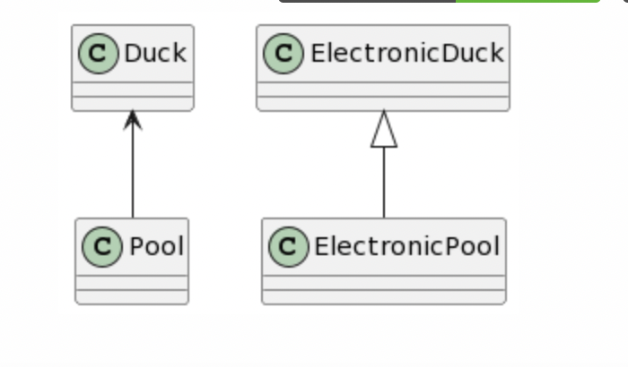

# SRP

**problem:** The problem in the example is that the Car Manager is taking care of everything

**Solution:** The solution here would be to split the work of the CarManager into different classes :	
- CarDB: contains the db instance
- CarRater: takes care of actions that involve rating cars, like comparing two cars and finding the best car in an array of cars
- CarRepository: CRUD operators

**Diagram:**

 

# OCP

**problem:** The problem in the example is in case of creating a new Resource type, it will require to update the allocate function in the Allocator class.

**Solution:** We make Time and Space resources inherit from an abstract Resource class, and each can then implement its own allocate and free methods.

**Diagram:**

# LSP

**problem:** The in the example is that the client class pool won't work for for electronic duck since it's turned off

**solution:** remove heritage and split the pool into a non electronic and an electronic one.

**Diagram:**

